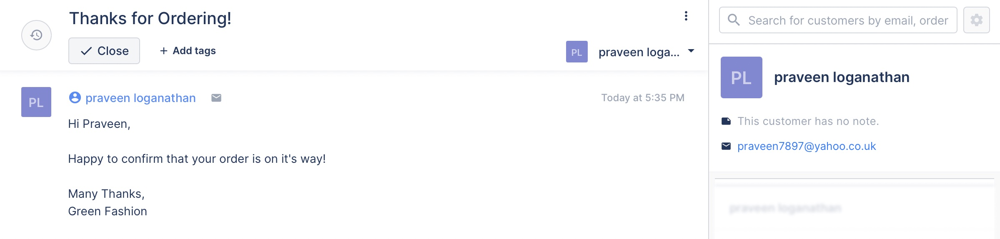
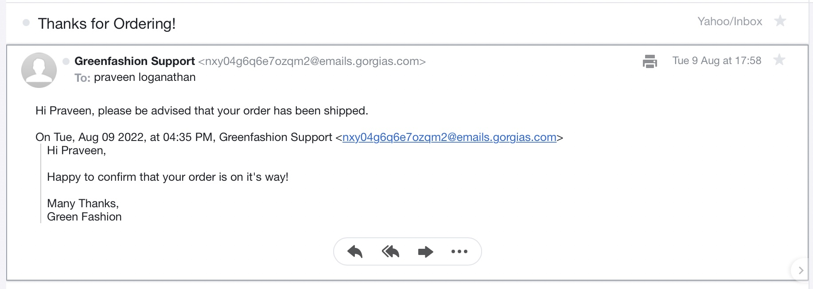
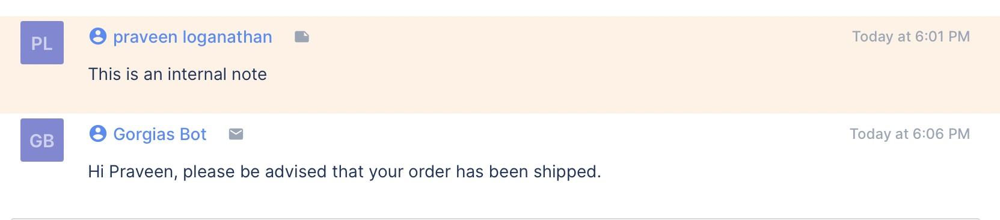

**Project: Gorgias Messaging Via REST API**

This repository contains a simple Python script that can be toggled to send an email to a customer or to create an internal-note within the customer's ticket.

### Example Ticket


### Example Email


### Example Internal Note


## Quick Start

These instructions will get you a copy of the project up and running on your local machine for development and testing purposes.

Clone this repository:

```
git clone https://github.com/PraveenLoganathan/Gorgias-Messaging
```

## Notes

In the Internal Note screenshot, please note that the message 'This is an internal note' was created manually and 'Hi Praveen, please be advised that your order has been shipped.' was created via API. Though the icons of these messages are different, both work as internal notes. This is because, an email isn't being sent in the 2nd case.
